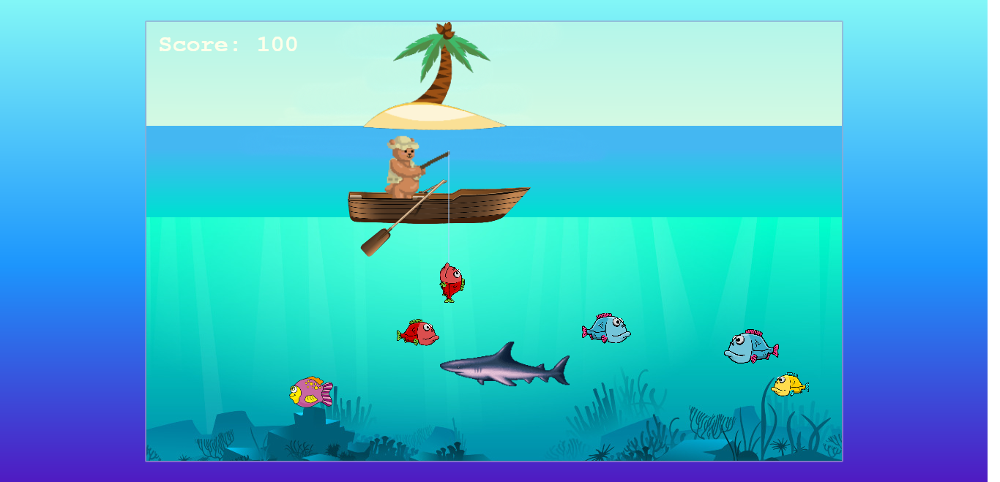
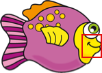

# Bear The Fisher

Bear The Fisher is a simple but addictive 2d fishing game. The game is built with Phaser 3 framework. The main goal is to help the bear catch fish and achieve the maximum score possible to break the records on the leaderboard. However, not all fish will give you score points. There are baddies that will eat the other fish and will end your game if they are caught. You guessed it right, they are sharks!

Currently, this game can be played only on the 1366x768 or higher screens.

Check [How To Play](#How-To-Play) section for gameplay details and controls.

## Application Screenshot

## How To Play

- ### Goal

     Help the bear to catch fishes and you will get score points for it.

- ### Controls

     Press the  [`Space`]  button to drop/pull the hook.

- ### Score

    Score points depend on the type and the scale of the fish.

    `Blue Red Yellow` : 50 points for small ones, 75 points for bigger ones

    `Purple` : 150 points for small, 250 for bigger ones

- ### Tip

    Try to aim at the mouth of the fish. Otherwise, they will ignore the hook.

    

- ### Game Difficulty 

    Sharks will be added by one as you get more scores. Avoid catching or feeding them with the fish on the hook. If you catch the shark, the game is over.
    Your score will be submitted to the leaderboard automatically when you refresh your maximum score.

    

## Built With

- HTML,
- CSS,
- ES6,
- Phaser 3
- Webpack
- VS Code
- Firefox Developer Edition
- Pixlr

## Live Demo

[Heroku](https://bearthefisher.herokuapp.com/)

## Setup

  If you want to try this application locally, follow the steps below:

  1. Clone the project using `git clone https://github.com/8Bts/To-Do-List` command.

  2. run `npm install`.

  3. Open index.html using your preferred local server.

## Author

👤 **Rashid Mammadli**

- Github: [8Bts](https://github.com/8Bts)
- Twitter: [@Rasheed49705929](https://twitter.com/Rasheed49705929)
- Linkedin: [Rashid Mammadli](https://www.linkedin.com/in/rashidmammadli/)
- Email: mcmizze@yahoo.com

## 🤝 Contributing

Contributions, issues, and feature requests are welcome!

Feel free to check the <a href="https://github.com/8Bts/Bear_The_Fisher/issues" target="_blank">issues page</a>.

## Show your support

Give a ⭐️ if you like this project!

## Acknowledgments

- [Microverse - Web Development School](https://www.microverse.org/)
- [MDN WEB DOCS](https://developer.mozilla.org/)
- [Robert Brooks](www.gamedeveloperstudio.com)
- [Open Game Art](https://opengameart.org/)
- [ECCO PC](https://www.deviantart.com/users/outgoing?https://eccothedolphin.online)
- <a href="https://www.w3schools.com/" target="_blank">w3schools.com</a> 
- <a href="https://www.stackoverflow.com/" target="_blank">Stackoverflow</a>
